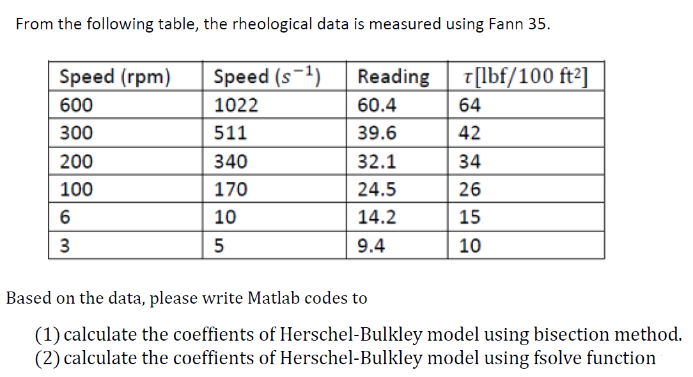

## Table of Content

Chapter: Numerical Approaches 

Exercise 1

 
 [Exercise 1](https://dansui.github.io/PET575/Chapter%203/Ex1.html)
 
 [Exercise 2](https://dansui.github.io/PET575/Chapter%203/Ex2.html)
 
 [Exercise 3](https://dansui.github.io/PET575/Chapter%203/Ex3.html)

 [Exercise 4, 1st ODE Method](https://dansui.github.io/PET575/Chapter%203/Ex4_1.html)
 
 [Exercise 4, 2nd ODE Method](https://dansui.github.io/PET575/Chapter%203/Ex4_2.html)
 
 [Exercise 6](https://dansui.github.io/PET575/Chapter%203/Ex6.html)
