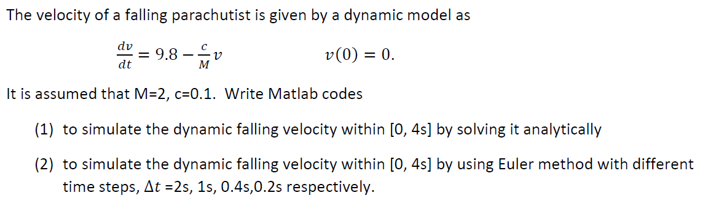
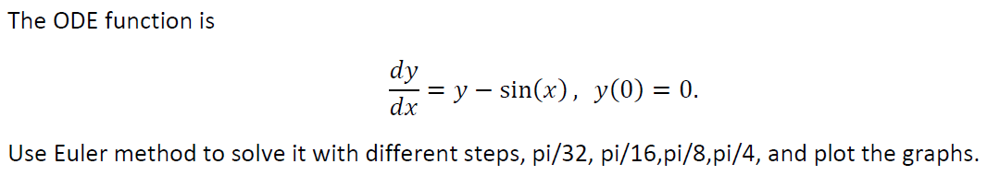
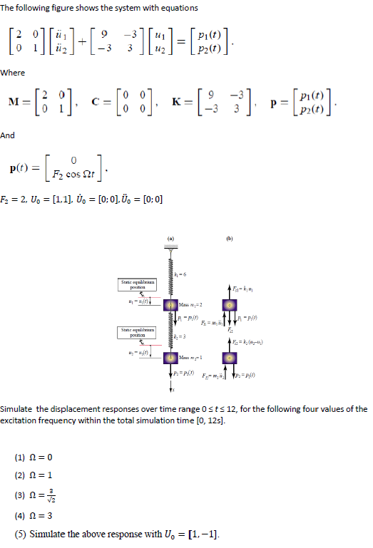
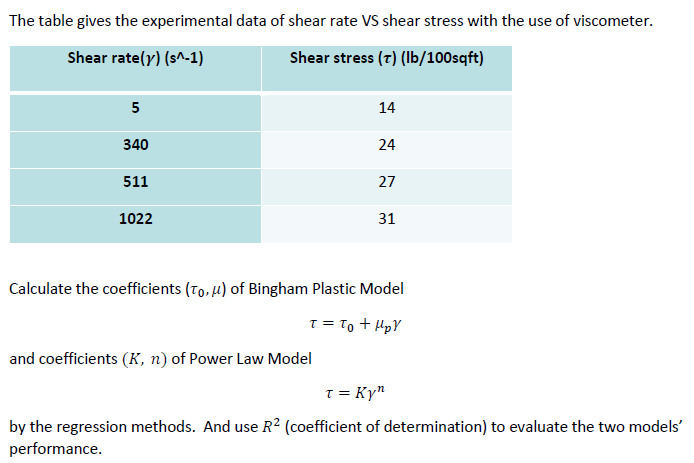

# Chapter: Numerical Approaches

## **Exercise 1**
From the following table, the rheological data is measured using Fann 35.

|Shear stress()|Shear stress() |
|-------|-----------|
|64|1022|
|42|511|
|34|340|
|26|170|
|15|10|
|10|5|

Now the Herschel-Bulkley model is considered as

Based on the data, please 

(1)	calculate the coeffients of Herschel-Bulkley model (, K, n) using bisection method;

(2)	calculate them using fsolve function.

 [Code for Exercise 1](https://dansui.github.io/PET575/Chapter%203/Ex1.html)
 
## **Exercise 2**

 
 [Code for Exercise 2](https://dansui.github.io/PET575/Chapter%203/Ex2.html)
 
 Exercise 3

 
 [Code for Exercise 3](https://dansui.github.io/PET575/Chapter%203/Ex3.html)
 
 Exercise 4

 [Code for Exercise 4, 1st ODE Method](https://dansui.github.io/PET575/Chapter%203/Ex4_1.html)
 
 [Code for Exercise 4, 2nd ODE Method](https://dansui.github.io/PET575/Chapter%203/Ex4_2.html)
 
  Exercise 5

 
 [Code for Exercise 5](https://dansui.github.io/PET575/Chapter%203/Ex6.html)

